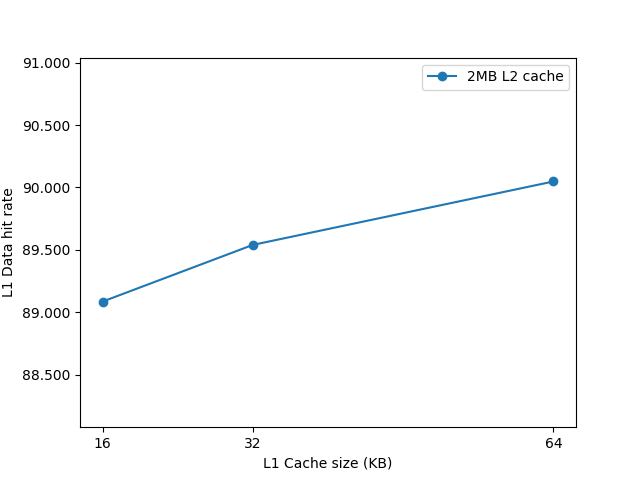
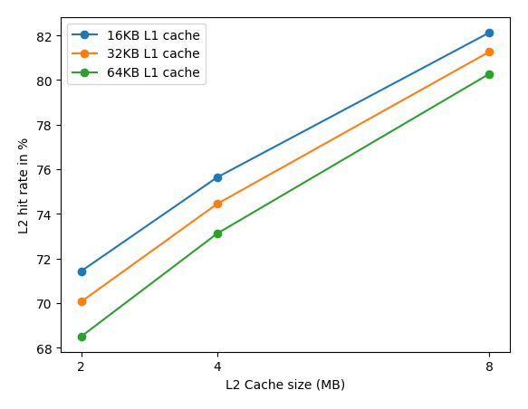
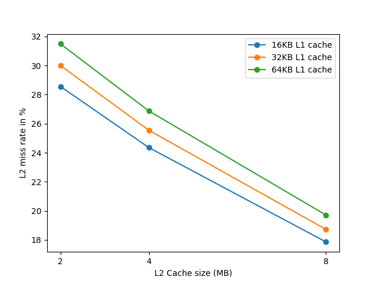
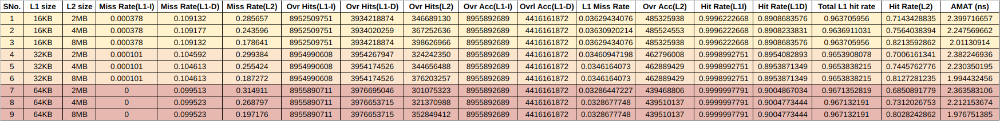

# Assignment 2 CS4032D Computer Architecture
The assignment entails comparing the performance of cache based on hit time, miss rate and average memory access time by varying the cache size of L1 and L2.
L1 = 16 KB, 32 KB, 64 KB
L2 = 2 MB, 4 MB, 8 MB

## Team members
|S.L. No.| Name | Roll number | 
| ----- | -------- | -------- | 
|1|Pavithra Rajan|B190632CS|
|2|Cliford Joshy|B190539CS|
|3|Karthik Sridhar|B190467CS|
|4|Jesvin Sebastian Madona|B190700CS|

## Installation and set-up
```console
sudo apt-get install build-essential git m4 scons zlib1g zlib1g-dev libprotobuf-dev protobuf-compiler libprotoc-dev libgoogle-perftools-dev python-dev python
```

```console
git clone https://gem5.googlesource.com/public/gem5
```

```console
cd gem5
scons build/<configuration>/gem5.opt -j <number of CPUs>
```
As my system uses x86, I will replace ```<configuration>``` with ```X86```. You can find the configuration and the number of CPUs by running the lscpu command.
```opt``` indicates debug and optimisation. ```debug``` can be used during debugging gem5 code without any optimisation. Other binaries to describe the optimisation level are fast, perf and prof.

## Run gem5

### Sample Run
```console
build/X86/gem5.opt configs/example/se.py -c tests/test-progs/hello/bin/x86/linux/hello
```
This is for running the simulation of a simple hello world program.

The output files are saved in the ```m5out``` directory. The files present are:
- ```stats.txt```: These are the gem5 simulation statistics.
- ```config.ini```: The simulated machine configuration in gem5
- ```config.json```: This is the same as config.ini but in jsonified format

### Benchmark Run
```console
cd SPEC
./runGem5.sh
```
In this script, the directory for gem5, SPEC benchmark and the input arg file paths have been specified. The SPEC program used is ```429.mcf```. The cache levels and cache sizes at each level can be specified as arguments. The CPU type used is ```TimingSimpleCPU```. 

<strong>Note: As we had to evaluate the metrics across varying L1 cache sizes of 16KB, 32KB and 64KB, we have split the size equally between L1d and L1i during the simulation. </strong>

TimingSimpleCPU is a CPU model that provides a simplified, cycle-accurate timing model of a simple, in-order, single-issue processor. It models the functional behavior of a CPU without considering many of the implementation details that affect performance, such as pipelining, caching, and branch prediction.

While this model is not intended to simulate the performance of a modern CPU accurately, it can be useful for simulating the behavior of simple programs and for quick, initial exploration of system-level performance tradeoffs.

## Benchmarks
There are 5 SPEC CPU benchmark programs. They are as follows:
- ```401.bzip2```: a compression/decompression program that uses the Burrows-Wheeler algorithm.
- ```429.mcf```: a program that solves a minimum-cost flow problem in a directed graph.
- ```456.hmmer```: a program that uses profile hidden Markov models (HMMs) to search for sequence homologs in a database.
- ```458.sjeng```: a chess program that plays the game using the Monte Carlo method.
- ```470.lbm```: a program that simulates fluid dynamics using the Lattice Boltzmann Method.

These can be found in the ```SPEC``` directory.

### 429.mcf

We have used ```429.mcf``` for simulation. The 429.mcf benchmark is a performance benchmark included in the SPEC CPU benchmark suite that measures the performance of a computer system when running the Mini-Contest File (MCF) application. 

MCF is a combinatorial optimization problem that arises in the context of planning the movement of goods through a transportation network. The MCF problem involves finding the optimal way to route goods from a set of suppliers to a set of destinations while minimizing the total transportation cost. 

The benchmark uses a set of real-world data files that represent transportation networks of varying sizes, and the goal is to find the optimal solution for each network within a given time limit. The benchmark is a representative workload for supply chain optimization and transportation planning applications, and its performance can provide insights into the capabilities of a computer system for these types of applications.


## Analysing gem5 output
- ```sim_seconds:``` how long the program ran in the simulated machine
- ```host_seconds:``` how long it took in the host machine

- ```system.cpu.dcache.overallMissRate::total:``` This attribute represents the total miss rate of the CPU's data cache. A cache miss occurs when the CPU requests data that is not available in the cache, and the data has to be retrieved from a higher level memory hierarchy (such as main memory).

- ```system.cpu.icache.overallMissRate::total:``` This attribute represents the total miss rate of the CPU's instruction cache. A cache miss occurs when the CPU requests an instruction that is not available in the cache and has to be retrieved from a higher level memory hierarchy.

- ```system.l2.overallMissRate::total:``` This attribute represents the total miss rate of the L2 cache. The L2 cache is a shared cache that sits between the CPU and the main memory. It is typically larger than the CPU's caches and is used to reduce the average memory access time.

- ```system.cpu.dcache.overallHits::total:``` This attribute represents the total number of hits (i.e., cache hits) in the CPU's data cache.

- ```system.cpu.icache.overallHits::total:``` This attribute represents the total number of hits in the CPU's instruction cache.

- ```system.l2.overallHits::total:``` This attribute represents the total number of hits in the L2 cache.

- ```system.cpu.dcache.overallAccesses::total:``` This attribute represents the total number of accesses (i.e., cache hits + cache misses) in the CPU's data cache.

- ```system.cpu.icache.overallAccesses::total:``` This attribute represents the total number of accesses in the CPU's instruction cache.

- ```system.l2.overallAccesses::total:``` This attribute represents the total number of accesses in the L2 cache.

## Plots
### L1 cache size v/s L1D Hit rate


Note: As the values of Data hit rate of L1D cache were very close by, we have plotted just the variation of the L1d hit rate with 2MB L2 cache. 

We can see that for a given L2 cache size, the L1 hit rate for both Data and Instruction Cache at the L1 level decreases.

### L2 Cache size v/s L2 Hit rate across different L1 cache sizes


It is evident from the graph that as the L2 cache size increases, the L2 hit rate increases. We can also see that as the L1 cache size increases, the Hit rate for L2 decreases. A possible interpretation would be that as the size of L1 cache decreases, the chances of finding the requested data in the L1 cache would also decrease, leading to more requests being sent to the L2 cache. This increased traffic to the L2 cache may result in more hits (i.e., the data being found in the L2 cache), which would increase the L2 hit rate.

However, it's important to note that this interpretation would depend on the specific architecture of the system being analyzed, and it may not always hold true. Other factors, such as the access patterns of the program being run, associativity and cache replacement policy could also influence the cache hit rates. 

Therefore, it's important to analyze the data in context and consider all relevant factors before drawing any conclusions.

### L2 Cache size v/s L2 Miss rate across different L1 cache sizes


Complementary to the above graph, we can observe a similar trend here with the same reasoning as stated earlier.

### L2 Cache size v/s L2 AMAT across different L1 cache sizes

<br> In this graph, we can observe that as the size of L2 cache increases, there is a sharp decline in the AMAT. However, as the L1 cache size increases, there is an increase in the AMAT at the L2 level.

### Table of data obtained



These are the default values that are set by the simulator and have been utilised while calculating AMAT.
|Metric| Cache Level | Time (in ns) | 
| ----- | -------- | -------- | 
|Hit Time|L1|1|
|Miss Penalty|L1|10|
|Hit Time|L2|10|
|Miss Penalty|L2|100|
## Directory details of gem5
```console
tree - L 1
```
```console
.
├── build
├── build_opts
├── build_tools
├── CODE-OF-CONDUCT.md
├── configs
├── CONTRIBUTING.md
├── COPYING
├── ext
├── include
├── KCONFIG.md
├── LICENSE
├── m5out
├── MAINTAINERS.yaml
├── pyproject.toml
├── README
├── RELEASE-NOTES.md
├── requirements.txt
├── SConsopts
├── SConstruct
├── site_scons
├── src
├── system
├── TESTING.md
├── tests
└── util

12 directories, 13 files
```
- build - formed after running the second build command
- build_opts - holds files that define default settings for build of different configurations
- configs - contains simulation configurations
- ext - contains gem5 dependencies which are external to gem5
- include - contains include files for compiling gem5
- m5out - all the output results can be found here
- src - contains gem5 source file 
- system - contains low level softwares like firmware or bootloaders in simulated system
- test - files related to gem5 regression tests
- util - contains utility scripts and programs
## gem5 Notes
- gem5 is an amalgamation of m5 and GEMS. 

- m5 is developed by the University of Michigan with multiple CPU models and ISA. It also has a classical memory model. CPU and memory in m5 interact with each other as master and slave using the available m5 ports.

- GEMS is built by University of Wisconsin with Ruby memory model.  It has different coherence protocols. 

- gem5 is a modular discrete event driven simulator. Events are stored in event queue and each event has a timestamp associated with it. 

- It is a full system simulator as it can simulate both user and kernel code. (SE and FS mode)

- It can operate in the SE mode which is the SysCall Emulation mode. It emulates the system level code. 

- gem5 simulates a machine on the host machine - simulated machine

- It takes a simulation script written in python as input and the simulated machine's behaviour is written in C++.

- Can simulate two CPU models - in-order and out of order

- Can have two memory models - classic and ruby memory model

